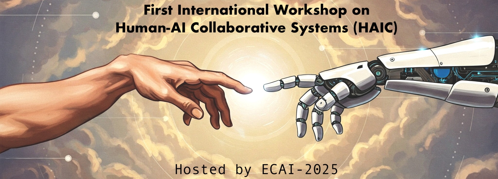

---
# Feel free to add content and custom Front Matter to this file.
# To modify the layout, see https://jekyllrb.com/docs/themes/#overriding-theme-defaults

permalink: /
title: 
layout: home
---

## Workshop Aim

Human-machine collaboration refers to a synergistic interaction aimed at improving the problem-solving capabilities and performance of humans and machines taken individually in achieving a goal or task. Such collaborative systems exploit the complementary strengths of humans, such as reasoning, creativity, emotional intelligence, and understanding of the social context, in concert with the advanced capabilities of artificial intelligence, including high computational power and efficient processing of large amounts of data.

The state of the art in HAIC is characterized by a wide spread of works and solutions that address the topic with highly domain-specific approaches. This mosaic of heterogeneous contributions is an advantage, as it makes it possible to propose applications that address particular problems by providing feasible solutions and, at the same time, contribute to increasing knowledge of the general topic. The research field of HAIC currently includes several successful approaches in healthcare, creative arts, and finance to name just a few. At the same time, from these works emerges the importance of starting to point towards a research direction that stresses—in a complementary and parallel way to domain-specific applications—a systemic and generic approach to these systems, which by their nature are very complex and heterogeneous.

Indeed, in order to develop effective, goal-oriented human-AI systems, endowed with collaborative intelligence in the true sense of the word, these systems must be able, among other things, to merge the complementary qualities of human and AI and adapt to each other’s needs, to incorporate quantitative and qualitative metrics, and to accommodate the novelties that emerge from the use of these systems. Moreover, these systems need trained people working at the human-machine interface, users trained to use them, and AI tools, in turn, able to adapt to the needs and peculiarities of the person using them, adapting to his/her knowledge and respecting his/her emotional sphere.

To enable this, the development of truly adaptive human-AI systems is crucial: this can enable the realization of personalized, specific, and unique systems, characterized by the history of their collaboration. This is only possible if an iterative refinement cycle is triggered that uses collaboratively generated data to train the AI system in real time. This requires a new appreciation and redefinition—adapted to this context—of well-known properties such as adaptability, security, trust, and explainability, but also a consideration of the psychological and ethical impact these systems may have on human users.

The aim of the first international workshop on Human-AI Collaborative Systems is twofold. On the one hand, we want to provide a space for researchers and practitioners to further stimulate the expansion and deepening of each of the research directions undertaken, stimulating dialogue and collaboration between the different communities. On the other, we want to promote a broader discussion that aims towards the definition of a general framework, capable of synthesizing common principles, thus offering a common foundation for future interdisciplinary and multimodal developments.

### Topics of Interest

#### Design and Development of HAIC Systems
- Frameworks and methodologies for designing human-AI collaborative systems.
- Designing principles for developing smart human-machine interfaces.
- Principles for adaptive systems that evolve with user interactions.
- Knowledge engineering for HAIC Systems.
- Metrics for evaluating the quality and effectiveness of collaborations.
- Novel approaches for the integration of human feedback into HAIC systems, in real-time.

#### Applications and Case Studies
- HAIC systems in assistive robotics scenarios.
- HAIC solutions for industrial challenges.
- HAIC systems for precision agriculture.
- Context-aware cobots for collaborative manufacturing.
- Human-AI co-creation in creative arts, including but not limited to music, visual art, and poetry.
- Collaborative decision-making systems.
- HAIC educational systems that prioritize learner control.
- Healthcare and precision medicine through collaborative intelligence.

#### Future Directions and Emerging Trends
- Approaches for controlling emergent dynamics in HAIC.
- Visionary HAIC applications in collective robotics, such as swarm robotics.
- Applications for co-creative processes human and AI.
- Definition of ethical guidelines for future HAIC research and developments.
- Psychological and societal implications of HAIC technologies.
